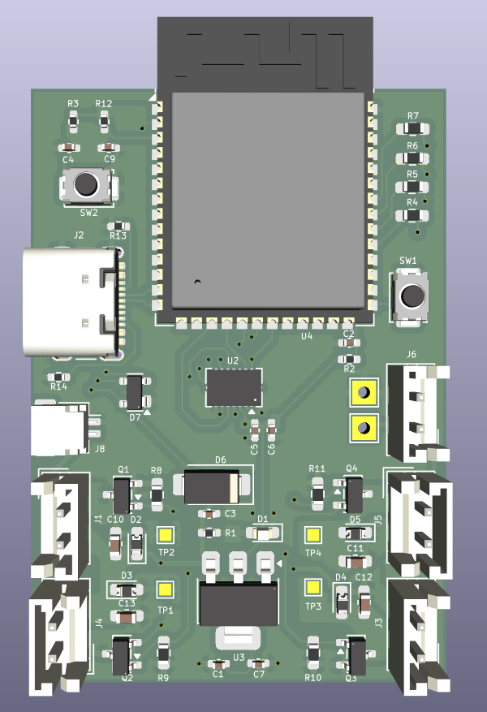
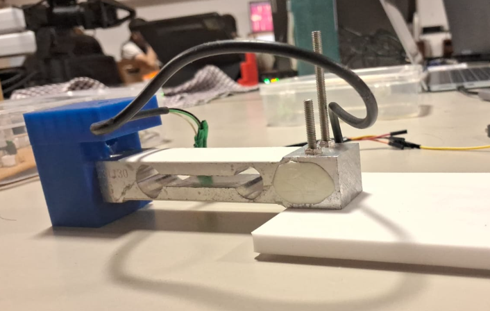
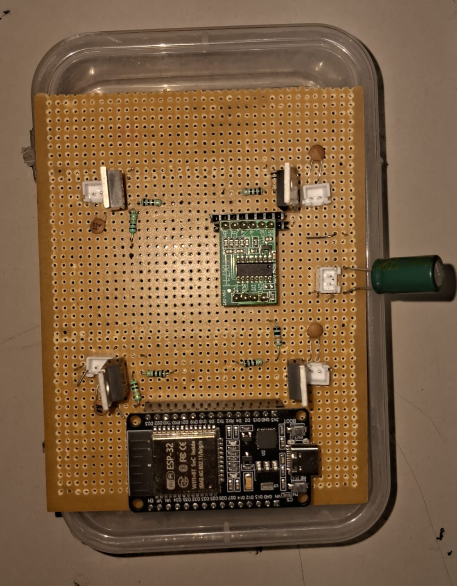
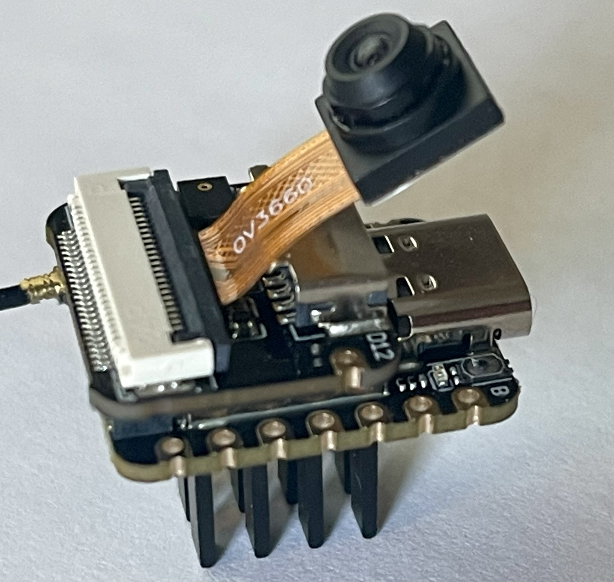

Icarus is a FPV quadcopter project by Roshan Castelino, Astha Sharma and Aryan Ghughare mentored under the guidance of Aryan Vyapari and Bhakti Assar.
Our main goal for this project is to create a drone which uses 8520 brushed motors and A ESP32-S3-Wroom-1 board along with a OV3660 camera module.

## Components:
We started by finalising our components and sensors along with the structure which we will be implementing in the project in order to have a firm background for the project,
### Our main components and sensors decided are:
1. ESP32-S3-Wroom-1 board (Main Microcontroller)
2. 8520 Brushed motors (Propulsion)
3. BMI 088 (6-DoF Inertial Measurement Unit)
4. Xiao-ESP32-S3-sense OV3660 (Camera Module)
4. USB- C Receptacle (Power and Programming Interface)

We selected the BMI088—a high-performance, 6-degree-of-freedom Inertial Measurement Unit (IMU)—specifically for its excellent vibration suppression and optimization for aerial environments, which are critical for stable drone flight.

## Segments for the drone:
### Schematic
We began by starting the schematic for our drone. Firstly observing and going through each datasheet for the sensors we chose for the drone. Each component was carefully chosen and connected keeping in mind that the schematic must look neat so that it would be easy to read.
The schematic for the drone has been pushed in the *Schematic and PCB* folder.

### PCB
Next step was the designing of the PCB. The PCB has been carefully placed keeping in mind reducing the noise which would be picked up by our IMU. Other parameters we kept in mind were, that our IMU would have to be centralised, each connection of the routing would have to be at obtuse angles, vias must be reduced, and overheating must be prevented. Keeping all these contraints in mind we came up with the final PCB design for our drone which we termed "Icarus Mk8".

The PCB for the drone has been pushed in the *Schematic and PCB* folder.

### Load Cell
We simultaneously worked on the functioning of the load cell. The load cell is a device which uses the concept of a wheatstone bridge in order to measure thrust. We needed the readings for thrust in our code to judge the lift of the drone. So we designed the stand for the load cell and calibrated the values accordingly to minimise our errors.

The Load cell code and working has been independently pushed in the *Load cell* folder.

### Motor Control
We wrote a motor control code and implemented it on a perfboard where we soldered on our connection and components of the motor driver. The basic function of our code was to treat each motor as individual and take inputs for each of them and later run the motors according to our desired speed.
Following image represents the perfboard connection which helped us confirm the succesful running of our code.

The Motor control code has been pushed in the *Firmware* folder.

### Camera Control
We have used the OV3660 camera module capturing live footage of the flight. We used the existing online code for the camera. However we noticed that the fps of the camera was very low, thus we were only achieving occasional images rather than a *VIDEO FEED*. We then edited the code to reduce the the quality setting it to *QVGA*, increased the fps, reset the exposure values to better set to quick changes, changed the code so that the cam picks up the latest footage and increased delays so that the cam will not get stuck. 

The Camera control code and explanation of the code has been pushed in the *Firmware* folder.

## Working of the firmware:
Flight firmware is basically a loop that runs hundreds of times per second, doing four things in order:
1. Read sensors
2. Estimate attitude
3. Compute correction (PID)
4. Drive motors

Let's break down each piece and how it talks to the next:
### 1.IMU driver (BMI088 over SPI)
This is the lowest layer it raw registers the information. Basically it reads/writes to the BMI088 over SPI *CSB1/CSB2, SCK, SDI, SDO1/SDO2* in the schematic. This code is used to obtain raw accelerometer (X,Y,Z) and raw gyroscope (X,Y,Z) numbers, in physical units (g's and °/s) after applying the sensor's scale factor. This means that this code gives no information about flying, it's just a translator between SPI registers and numbers.

### 2.Sensor fusion (attitude estimation)
Raw gyroscope tells you rotation rate (how fast you're tilting), but drifts over time. Raw accelerometer tells you absolute tilt relative to gravity, but is noisy and gets confused by vibration/acceleration. A fusion algorithm blends the two so you get a stable estimate of current roll and pitch angle, and a clean yaw rate. Also yaw rate is very important in maintaining the stability of the drone so we have decided to keep it fixed for this reason to reduce errors.

### 3.PID controllers (making a decision)
PID control uses three parameters to correct your position in real time namely *Proportional, Integral and a Differential term*.We have implemented two regimes namely launch_start and flight_start. These two basically separate the launch of the drone from zero state to our desired state until hovering is achieved and the motion of the drone after hovering is achieved.The transistion is covered by gain_blend in order to make the motion seamless. PID calculation is then done on these states and we have made use of interpolation for the transistion states.

### 4.Mixer (turning 3 corrections + throttle into 4 motor speeds)
For a quad-X layout, each motor gets some combination of throttle, roll, pitch, and yaw.Upon this information the motors will rotate to satisfy the desired outcome for the position in space of the drone. Each mixed value gets clamped to a valid range and written out as a PWM duty cycle on the GPIO driving each MOSFET gate. 

### 5.Command input
 Our input that is our *"desired angle/throttle"* will come from Wi-Fi (UDP from a phone). We implement a website with an interface which is tailored to the movement and control of the drone.

## Goals:
To bring Project Icarus to completion, we mapped out the following milestones:
### Hardware & Structural Design:
1. Designing the system schematic.
2. Positioning each component and sensor to secure maximum efficiency.
3. Layout and routing of the custom PCB.
4. Making a custom perfboard of the Motor control to understand its working and make it efficient.
5. Designing a custom test frame integrated with a load cell to measure motor thrust.
6. Designing the final, corrected quadcopter frame tailored to fit the fabricated PCB.

### Firmware & Flight Control:
1. Writing low-level drivers and firmware for the onboard sensors (IMU).
2. Understanding and implementing how each part of the firmware will relate to each other and give a desirable feedback to control the drone.
3. Developing and optimizing the flight control loop algorithms to achieve stable flight.
4. Lastly, attaching the camera module to achieve an fpv drone which gives live feed as it moves along.